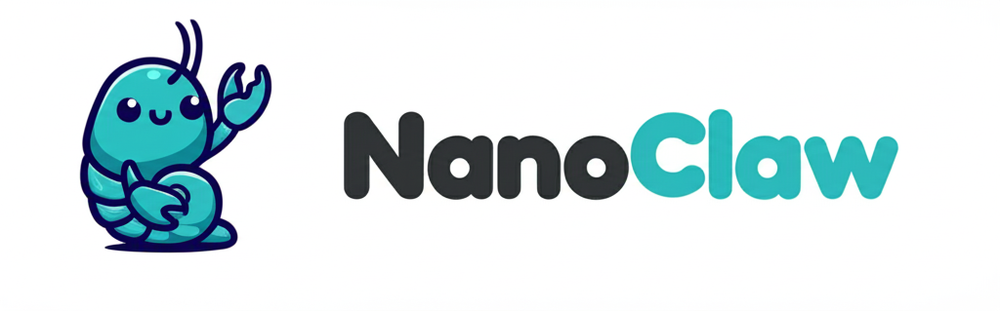

<p align="center">
  
</p>

<p align="center">
  My personal AI assistant. Lightweight and built to be understood and customized for your own needs.
</p>

## Why I Built This

[OpenClaw](https://github.com/openclaw/openclaw) is an impressive project with a great vision. But I can't sleep well running software I don't understand with access to my life. OpenClaw has 52+ modules, 8 config management files, 45+ dependencies, and abstractions for 15 channel providers. Security is application-level (allowlists, pairing codes) rather than OS isolation. Everything runs in one Node process with shared memory.

BearClaw gives you the same core functionality in a codebase you can understand in 8 minutes. One process. A handful of files. Agents run through a selectable agent backend directly on your machine.

## Quick Start

```bash
git clone https://github.com/gavrielc/bearclaw.git
cd bearclaw
npm install
npm run setup
```

`npm run setup` asks for an agent-backend credential, a default model tier, an assistant name and a web
password, writes them to the config database at `~/.bearclaw/bearclaw.db`, seeds
the starter context, renders the launchd services, builds both apps and starts
them. It is safe to rerun.

Then open <http://127.0.0.1:3030>. Anything setup could not fill in is asked for
by the first-run wizard at `/setup`, which also wires up your channels and lets
you edit `USER.md`, `SOUL.md` and the main agent's `IDENTITY.md` before the
first conversation.

## Philosophy

**Small enough to understand.** One process, a few source files. No microservices, no message queues, no abstraction layers. Have Claude Code walk you through it.

**Built for one user.** This isn't a framework. It's working software that fits my exact needs. You fork it and have Claude Code make it match your exact needs.

**Customization = code changes.** No configuration sprawl. Want different behavior? Modify the code. The codebase is small enough that this is safe.

**AI-native.** Setup is one command and a browser page, not a manual. No monitoring dashboard; ask Claude what's happening. No debugging tools; describe the problem, Claude fixes it.

**Skills over features.** Contributors shouldn't add features (e.g. support for Telegram) to the codebase. Instead, they contribute [claude code skills](https://code.claude.com/docs/en/skills) like `/add-telegram` that transform your fork. You end up with clean code that does exactly what you need.

**Best harness, best model.** BearClaw supports Pi with ChatGPT Codex authentication and retains Claude Agent SDK compatibility. The harness matters: a good harness gives capable models the tools and context to be useful.

## What It Supports

- **WhatsApp I/O** - Message your assistant from your phone
- **Isolated agent context** - Each agent has its own `IDENTITY.md`, working directory, memory, and conversation session
- **Main channel** - Your private channel (self-chat) for admin control; every other agent is isolated
- **Workflows** - Scheduled or event-driven flowcharts of typed nodes, with human approval steps, that run an agent and can message you back
- **Web access** - Search and fetch content
- **Optional channels & integrations** - Add Telegram (`/add-telegram`), iMessage (`/add-imessage`), Gmail (`/add-gmail`), and more via skills

## Usage

Talk to your assistant with the trigger word (default: `@Andy`):

```
@Andy send an overview of the sales pipeline every weekday morning at 9am (has access to my Obsidian vault folder)
@Andy review the git history for the past week each Friday and update the README if there's drift
@Andy every Monday at 8am, compile news on AI developments from Hacker News and TechCrunch and message me a briefing
```

From the main channel (your self-chat), you can manage agents and tasks:

```
@Andy list all scheduled tasks across agents
@Andy pause the Monday briefing task
@Andy join the Family Chat group
```

## Customizing

There are no configuration files to learn. Just tell Claude Code what you want:

- "Change the trigger word to @Bob"
- "Remember in the future to make responses shorter and more direct"
- "Add a custom greeting when I say good morning"
- "Store conversation summaries weekly"

Or run `/customize` for guided changes.

The codebase is small enough that Claude can safely modify it.

## Contributing

**Don't add features. Add skills.**

If you want to add Telegram support, don't create a PR that adds Telegram alongside WhatsApp. Instead, contribute a skill file (`.claude/skills/add-telegram/SKILL.md`) that teaches Claude Code how to transform a BearClaw installation to use Telegram.

Users then run `/add-telegram` on their fork and get clean code that does exactly what they need, not a bloated system trying to support every use case.

### RFS (Request for Skills)

Skills we'd love to see:

**Communication Channels**

- `/add-telegram` - Add Telegram as channel. Should give the user option to replace WhatsApp or add as additional channel. Also should be possible to add it as a control channel (where it can trigger actions) or just a channel that can be used in actions triggered elsewhere
- `/add-slack` - Add Slack
- `/add-discord` - Add Discord

**Platform Support**

- `/setup-windows` - Windows via WSL2
- `/setup-linux` - Linux setup

**Session Management**

- `/add-clear` - Add a `/clear` command that compacts the conversation (summarizes context while preserving critical information in the same session). Requires figuring out how to trigger compaction programmatically via the Claude Agent SDK.

## Requirements

- macOS
- Node.js 20+
- [Claude Code](https://claude.ai/download) (`npm install -g @anthropic-ai/claude-code`)
- [bun](https://bun.sh), which builds and runs the web UI

## Service Management

BearClaw runs as two launchd services: the main process
(`~/Library/LaunchAgents/com.bearclaw.plist`) and the web UI
(`com.bearclaw.web.plist`). `npm run setup` writes both.

```bash
# Start
launchctl load ~/Library/LaunchAgents/com.bearclaw.plist

# Stop
launchctl unload ~/Library/LaunchAgents/com.bearclaw.plist

# Restart (also how a settings change takes effect)
launchctl kickstart -k gui/$(id -u)/com.bearclaw

# Check status
launchctl list | grep bearclaw
```

Check the install, one line per check:

```bash
npm run doctor       # or `bearclaw doctor` after a build
```

Move an install to another Mac, or keep a backup:

```bash
bearclaw export                  # config database + channel credentials, secrets in the clear
bearclaw import bundle.tgz       # restore, then run setup for the machine-local parts
```

Settings live in the config database. Read and write them from the CLI, or from
Admin > Settings in the web UI:

```bash
npm run cli -- config list
npm run cli -- config set TELEGRAM_BOT_TOKEN 123456:abc
```

Logs:

```bash
tail -f logs/bearclaw.log        # Main log
tail -f logs/bearclaw.error.log  # Errors
tail -f logs/bearclaw.web.log    # Web UI
cat ~/.bearclaw/var/agents/main/logs/agent-*.log | tail -50  # Agent logs
```

Re-authenticate WhatsApp (if disconnected):

```bash
npm run auth
launchctl kickstart -k gui/$(id -u)/com.bearclaw
```

## Architecture

```
WhatsApp (baileys) --> SQLite --> Polling loop --> Claude Agent SDK (in-process) --> Response
```

Single Node.js process. Agents execute via the Claude Agent SDK directly in the host process with per-agent working directories. IPC via filesystem. No daemons, no queues, no complexity.

Key files:

- `src/index.ts` - Entry: loads the config database into the environment, then `app.ts`
- `src/app.ts` - Main app: channel connections, routing, IPC
- `src/cli.ts` - The `bearclaw` command: setup, doctor, export, import, config
- `src/agent/runner.ts` - Runs the Claude Agent SDK in-process
- `src/agent/ipc-mcp.ts` - MCP tools for agent ↔ host communication (send*message, workflow*\_, trigger\_\_, context_write, image_generate, …)
- `src/workflows/engine.ts` - Runs workflows: the decider, retries, waits, recovery
- `src/workflows/triggers.ts` - Cron, one-shot, event and webhook triggers
- `src/db.ts` - SQLite operations
- `~/.bearclaw/bearclaw.db` - Config database: settings, agents, context, skills, workflows, MCP servers
- `~/.bearclaw/var/` - Runtime state: messages, channel credentials, logs, conversation archives

## FAQ

**Why WhatsApp and not Telegram/Signal/etc?**

Because I use WhatsApp. Fork it and run a skill to change it. That's the whole point.

**Is this secure?**

Agents run directly on the host, so they have access to the host filesystem. Each agent runs with `cwd` set to its own `~/.bearclaw/var/agents/{folder}/` directory, and the `settingSources: ['project']` option means it reads project settings from that folder. However, there is no OS-level isolation between agents — a determined prompt injection could access files outside the agent folder. For stronger isolation, you could run BearClaw in a container itself. See [docs/SECURITY.md](docs/SECURITY.md) for the full security model.

**Where does my configuration live?**

In one SQLite database, `~/.bearclaw/bearclaw.db`: settings and secrets, the agent registry, your context documents, skills, workflow definitions and MCP servers. There are no config files to hand-edit and no `.env`. Change things with `bearclaw config`, the web admin, or by editing the code. The codebase is small enough that behavior changes belong in code rather than in a growing settings surface.

**How do I debug issues?**

Ask Claude Code. "Why isn't the scheduler running?" "What's in the recent logs?" "Why did this message not get a response?" That's the AI-native approach.

**Why isn't the setup working for me?**

Run `npm run doctor` first: it checks the config database, the Claude token, the model, the password, the channel credentials, both launchd services and the two HTTP ports, and prints what failed. If that doesn't explain it, run `claude` and then `/debug`. If Claude finds an issue that is likely affecting other users, open a PR.

**What changes will be accepted into the codebase?**

Security fixes, bug fixes, and clear improvements to the base configuration. That's it.

Everything else (new capabilities, OS compatibility, hardware support, enhancements) should be contributed as skills.

This keeps the base system minimal and lets every user customize their installation without inheriting features they don't want.

## License

MIT
